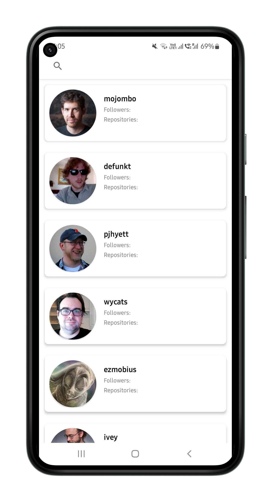
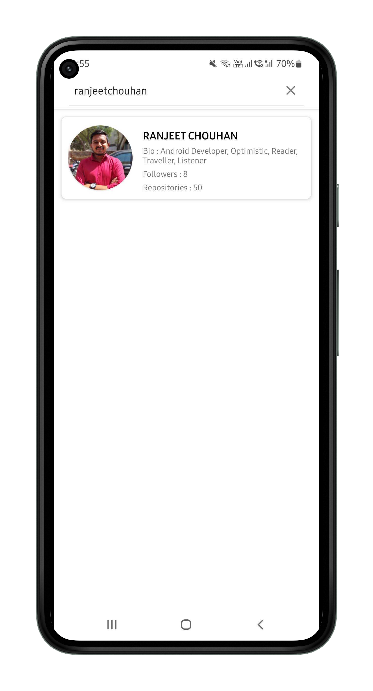
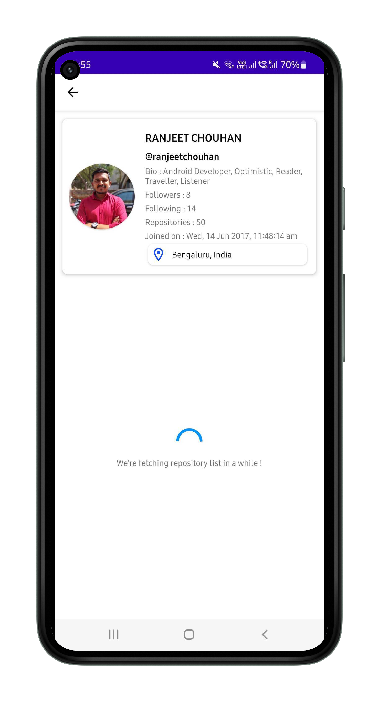
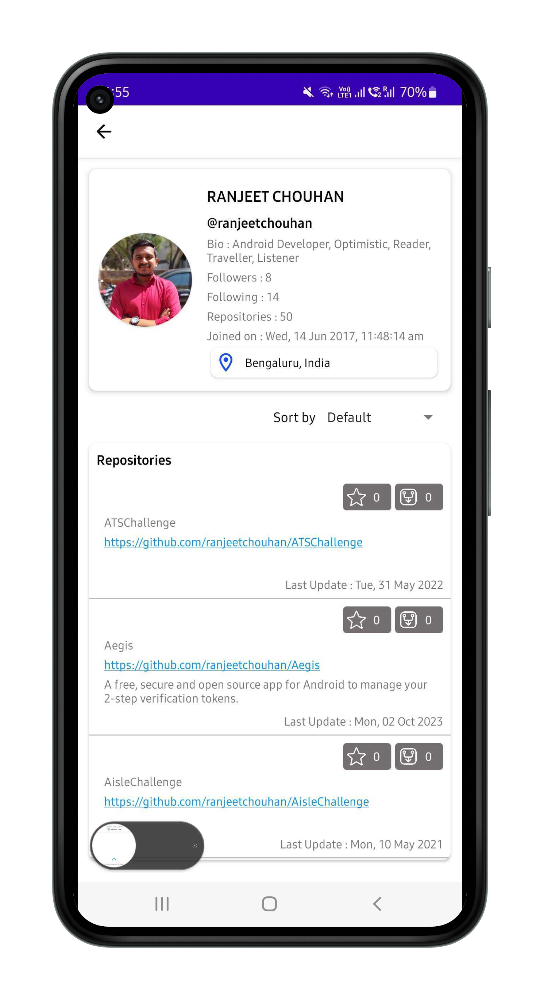

# PekoInterviewAssessment

Android application that uses GitHub API to fetch and display user profiles and repositories. Users should be able to search for GitHub users by username and view their profiles along with a list of repositories.

**Note:** GitHub API has a limited number of API calls every hour. If exhausted then try with VPN or wait for sometimes (Probably 60 minutes).

### MainActivity

By default, we are fetching a user list from the GitHub API. Endpoint "/users".
- Search functionality is available in this screen.
- If you search for a user with a username, it will show you the result.
- Tap on a result to move to the Profile Screen.

### UserProfileActivity

User Profile can be viewed in this screen with bio, username, repositories, followers, following, city (if available).
- Repository public link is clickable, opening in Google Chrome.
- City Marker is clickable, opening in Google Maps.

## Screenshots

## How to Use

- Clone the repository to your local machine.
- Open the project in Android Studio.
- Build and run the app on an emulator or physical device.

## Credits

This app was developed as part of the Peko Interview Assessment.